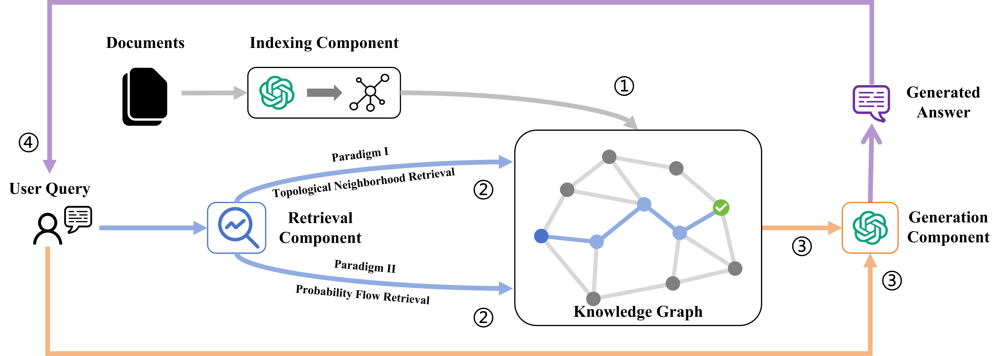
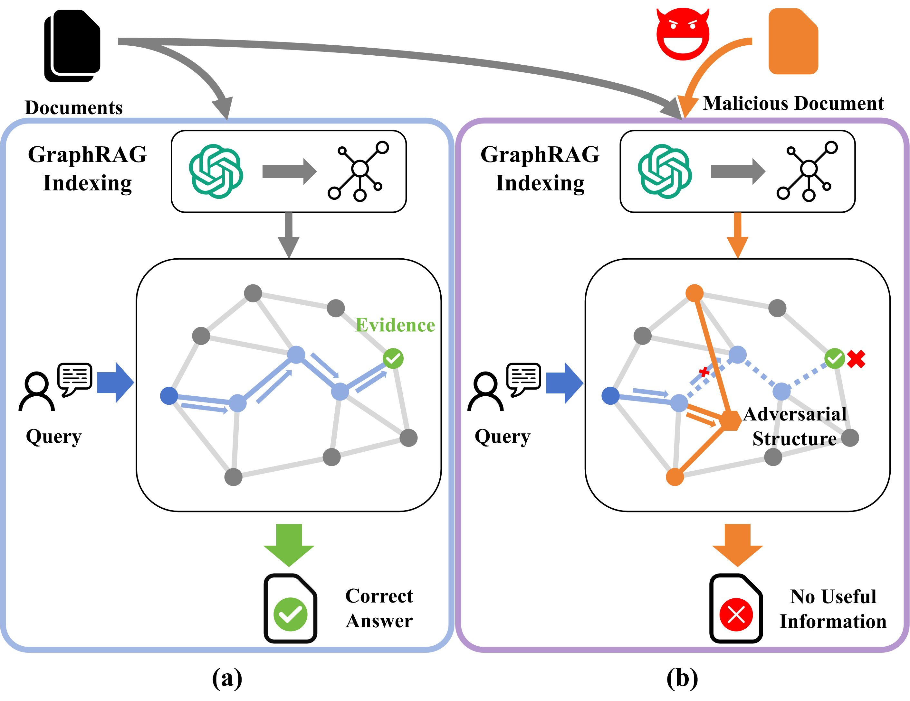
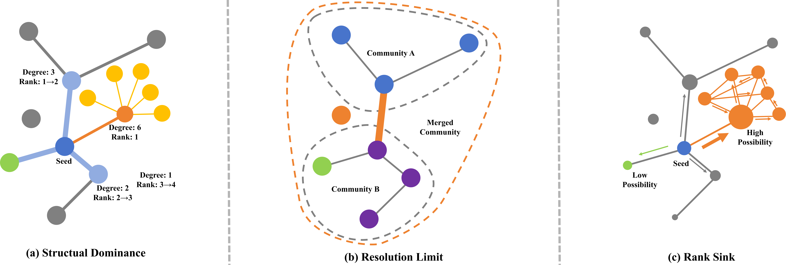
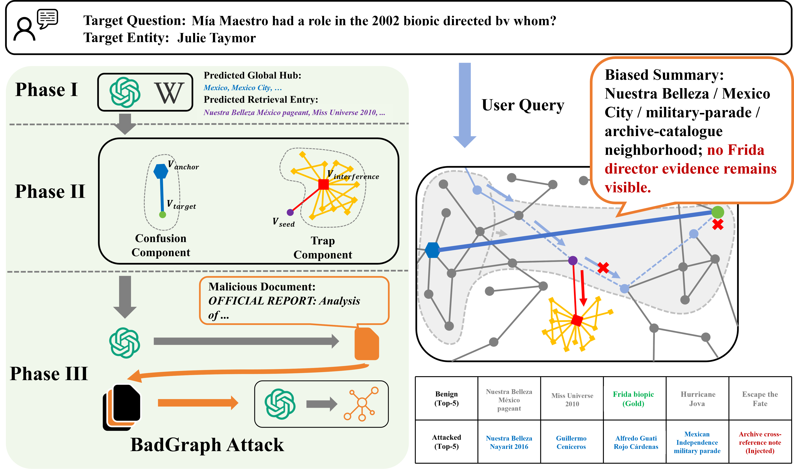

# BadGraph

Artifact for **BadGraph: Structural Knowledge Isolation Attacks against Graph
Retrieval-Augmented Generation**.

BadGraph studies an append-only poisoning attack against GraphRAG
retrieval systems. The attacker adds neutral documents before indexing. Normal
graph extraction then turns those documents into extra entities and
relationships, which can dilute or redirect the graph evidence reached by local
retrieval.

## Paper-Guided Overview

### 1. GraphRAG Retrieval Setting



Mainstream GraphRAG systems first transform corpus documents into graph units:
entities, relationships, community summaries, and source chunks. Retrieval then
starts from query-related entities and expands over graph structure before the
generator receives the assembled context. BadGraph targets this graph-retrieval
stage rather than the final answer generator.

### 2. Structural Knowledge Isolation



BadGraph is a targeted availability attack. The attacker appends neutral
documents before indexing; normal GraphRAG extraction turns those documents into
additional nodes, edges, and source units. The goal is not to force a specific
wrong answer. Instead, the injected topology competes with or redirects graph
retrieval so that the needed evidence is displaced from the final context.

### 3. Why Topology Is Attackable



The paper analyzes three graph-level failure modes that motivate the released
workflow:

- **Structural dominance**: high-degree injected neighborhoods can compete with
  semantically relevant evidence during local entity and relationship ranking.
- **Resolution limit**: bridge edges can make target evidence more likely to be
  absorbed into a broader, less focused community, diluting community-level
  summaries.
- **Rank sink**: dense injected subgraphs can trap probability flow in
  propagation-based retrieval, reducing the relative visibility of target
  evidence.

### 4. Released Attack Workflow



`BadGraph_Attack_Workflow.ipynb` follows the paper's three phases:

- **Phase I: Anchor prediction.** Predict query-related semantic anchors that
  GraphRAG retrieval is likely to reach.
- **Phase II: Structural planning.** Allocate the append-only budget into the
  Trap Component and, for MS-GraphRAG community-summary retrieval, the
  Confusion Component implemented through bridge relations.
- **Phase III: Linker document generation.** Convert the intended graph
  structure into neutral archive/catalogue-style documents that can be inserted
  before indexing.

## Setup

```bash
uv run --with-requirements requirements.txt python -c "import networkx, yaml, httpx"
```

`offline_qa_validate.ipynb` runs without remote API access. The generation notebooks
use the OpenAI API when credentials are configured.

## Contents

- `BadGraph_Attack_Workflow.ipynb`: BadGraph attack-document generation.
- `GragPoison_Baseline.ipynb`: GragPoison baseline generation.
- `TKPA_UKPA_Baselines.ipynb`: TKPA/UKPA baseline generation.
- `offline_qa_validate.ipynb`: offline validation for released QA examples.
- `attack_samples/`: six JSONL files with five examples per dataset/system pair.
- `graphs/`: pre-extracted graph files used by the notebooks.
- `assets/`: paper figures used to explain the threat model and workflow.

## Run

```bash
uv run --with-requirements requirements.txt jupyter nbconvert --to notebook --execute offline_qa_validate.ipynb
```

The default validation does not call a remote API. Optional LLM settings are in
`config.yaml`.

## Ethics

The released notebooks are scoped to method inspection, reproduction on
released examples, and offline validation.
